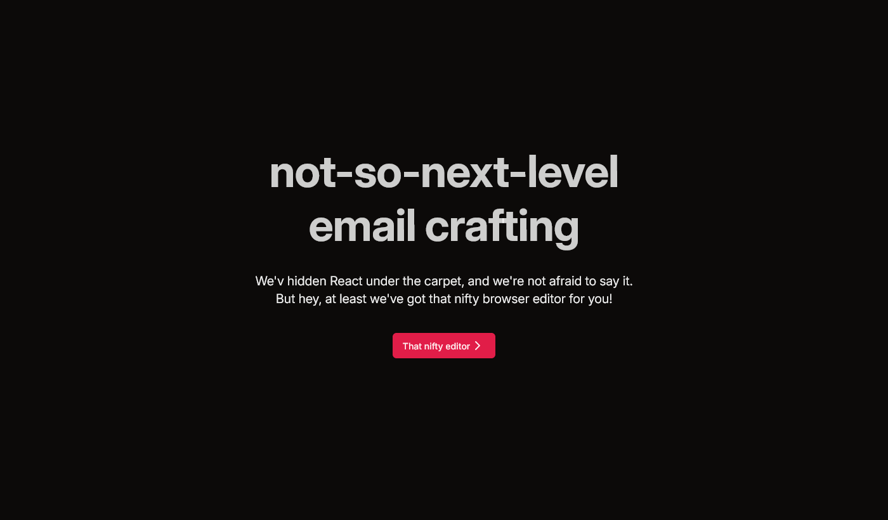
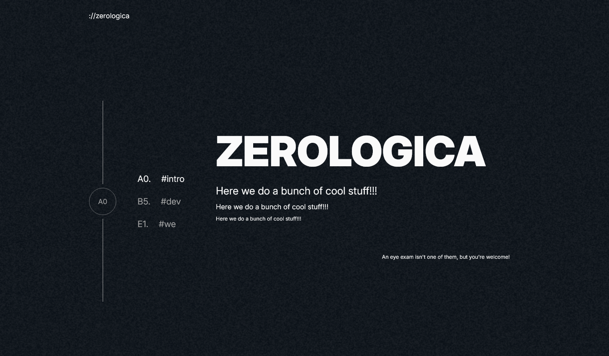
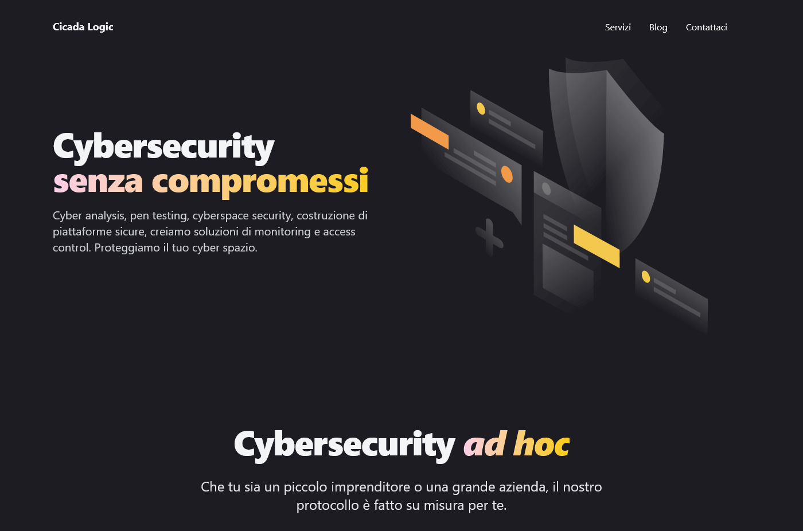

# Hello There, I'm Luca!

I am a regular dude, I like pizza, do not like chocolate nor coffee, well, coffee is ok, but no sugar!!!

I like to hack things, figure out how stuff works, and make things work again.

I do not like WHEN STUFF BREAKS!!!

So listen to me, and do not break stuff, ok? OK??? Are we clear? Good!

Now that's out of the way, let's talk even more about me, shall we?
Hey yoy are reading this, so I guess you are interested in me, so let's go!

...

This is awkward, come back later when I have figured out what to write here, ok?

<h2 align="center">Where you can find me</h2>

<h2 align="center">Even more badges!!!</h2>

<h2 align="center">Stats</h2>

  
  

<h2 align="center">Projects</h2>

<h2 align="center">Products</h2>

<h2 align="center">Contributions</h2>

